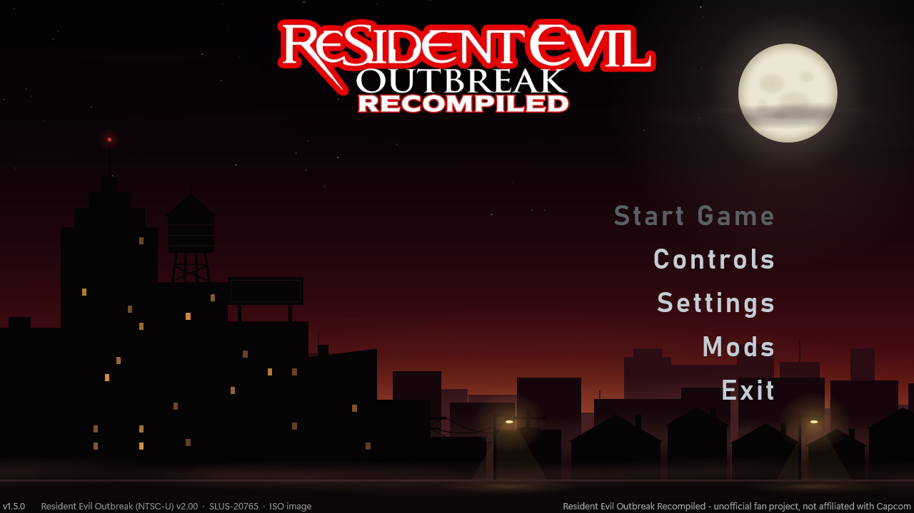
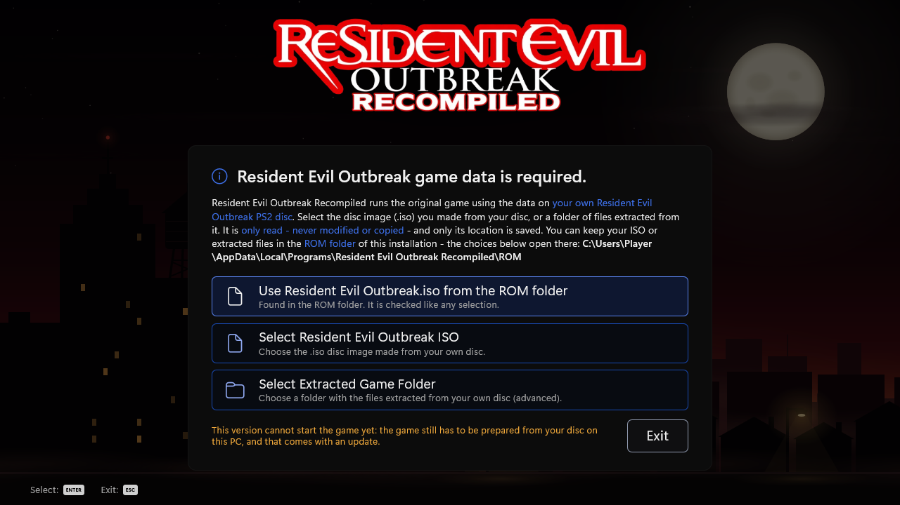
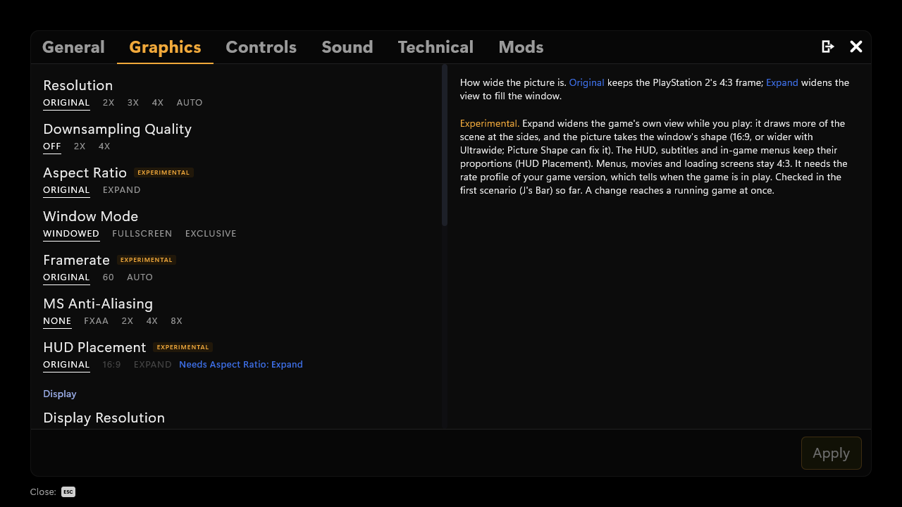
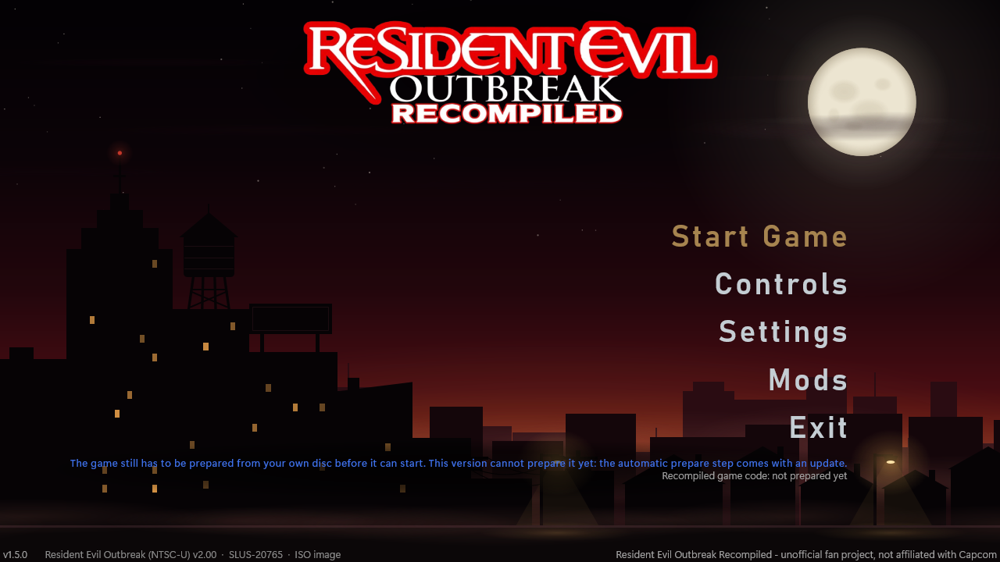

# Resident Evil Outbreak Recompiled

**An unofficial PC port of Resident Evil Outbreak (File #1, USA) for Windows.**

Resident Evil Outbreak Recompiled runs the original PlayStation 2 game as a native Windows program. The game's own
code is statically recompiled into native x64 code. It runs on a PC runtime written for it, not in an emulator. The
game's data (models, textures, sounds, movies, scripts) is read from **your own copy** of the game. Nothing from the
game is included in the download.

  
  

  
  

The program's own menus, captured from the program itself with sample data. No game
pictures.

> [!IMPORTANT]
> **Version 1.5.0 cannot start the game yet.** The installer sets up the program, its settings, the mod framework and
> the documentation. On first start you choose your own disc image (or files extracted from your disc). The program
> checks your choice and remembers it. Before the game can start, its code has to be prepared from your disc on your
> PC: converted and compiled there, once. **That automatic preparation comes in an update.** Until then, the game data
> screen and *Start Game* tell you so. You can already set up your game data, settings, controls and mods.

## Download and install

1. Download `ResidentEvilOutbreakRecompiled-1.5.0-Setup.exe` from [Releases](../../releases).
2. Run it. By default it installs for your Windows user only, with no administrator rights needed, into
   `%LOCALAPPDATA%\Programs\Resident Evil Outbreak Recompiled`. *Install for all users* is available too. The setup is
   not code-signed yet, so Windows SmartScreen may warn about an unrecognized app.
3. Start **Resident Evil Outbreak Recompiled**. It asks for your game data:
   - **Select Resident Evil Outbreak ISO**: the disc image (`.iso`) you made from your own disc, or
   - **Select Extracted Game Folder**: a folder with the files extracted from your disc, or
   - put your ISO or extracted folder into the installation's empty **ROM** folder first. The program then offers
     *Use &lt;name&gt; from the ROM folder*.

   Your game data is only read, never modified or copied. Only its location is saved.

**You need your own legal copy of the game**: the USA release of Resident Evil Outbreak for the PlayStation 2,
SLUS-20765, disc version 2.00. Other releases of File #1 (USA 1.01, Europe, Japan) are recognized but not supported
yet. Outbreak File #2 is not supported.

**Requirements:** Windows 10 or 11 (64-bit) and a graphics card with Direct3D 11. Vulkan is optional and comes with
your graphics driver. No Visual C++ redistributable is needed.

Your settings, saves, mods and logs are stored in your Windows profile (`%APPDATA%` and
`%LOCALAPPDATA%\Resident Evil Outbreak Recompiled`). When you uninstall, you are asked whether to remove them; the
default answer keeps them. Uninstalling never touches your disc image or extracted files.

## Features

These are the features of the program as it is now. In-game features take effect once the game can be prepared and
started (see the note above).

**The game, natively**
- The game's PlayStation 2 code, recompiled to native x64 code, running on a PC runtime for the console's hardware:
  the Emotion Engine, the vector units, the Graphics Synthesizer, the I/O processor with the game's own sound driver,
  the SPU2 sound chip, movie playback and the memory card.
- The original timing at the game's own 30 frames per second.
- An optional **60 fps mode** (*Settings > Graphics > Framerate*: Original / 60 / Auto), marked experimental.
- **Skip Intro Movies**, and a main menu that can play a background video of your own.

**Graphics**
- A Direct3D 11 hardware renderer (the default), a Vulkan renderer that draws the same pictures, and a software
  reference renderer.
- Internal resolution 2x, 3x, 4x, or Auto (matched to your window), with downsampling.
- MSAA (2x, 4x, 8x) and FXAA.
- Texture filtering and up to 16x anisotropic filtering.
- Scaling filters: Nearest, Bilinear and Sharp Bilinear.
- Widescreen (*Aspect Ratio: Expand*, 16:9 and ultrawide) with a choice of HUD placement. Marked experimental: checked
  in the first scenario so far.
- Windowed, borderless fullscreen and exclusive fullscreen.
- Brightness and gamma, a CRT effect, color filters for color vision deficiencies, and **Reduce Flashing**.

**Controls**
- Controllers (XInput, DualShock 4, DualSense) and keyboard and mouse, fully remappable.
- PlayStation, Xbox or keyboard button symbols in the game's own prompts.
- Compensate Game Deadzone, Mouse Acceleration and **Hold To Toggle** for held buttons.

**Saves**
- The game saves to a virtual memory card in your profile, with backups. It uses the same raw `.ps2` layout as PCSX2,
  so cards can be exchanged.
- Save Profiles give each profile its own card. *Portable Saves* keeps the cards next to the program.

## Mods

The program has a **mod framework**:
- The Mods tab installs mods (a `.zip` or a mod folder), switches them on and off, orders them and changes their
  settings.
- Mods can replace the game's files without changing your disc image.
- Mods can carry code that runs in a sandbox and changes the game only through the program's feature system.
- The modding guide is installed with the program (`docs\MODDING.md`).

Three mods are published as their own downloads:

| Mod | What it does | Download |
|---|---|---|
| **Modern Camera** | An over-the-shoulder camera with right-stick and mouse look, aiming, free aim and a crosshair, with its own camera window (F8) for tuning. | [REO-ModernCam](https://github.com/RaccoonRecomp/REO-ModernCam) |
| **Cheats** | The regular (original release) cheat set, each cheat its own option. | [REO-Cheats](https://github.com/RaccoonRecomp/REO-Cheats) |
| **Greatest Hits Cheats** | The Greatest Hits cheat set, each cheat its own switch. | [REO-GreatestHits-Cheats](https://github.com/RaccoonRecomp/REO-GreatestHits-Cheats) |

The Modern Camera was recreated for the PC recompilation by studying how Snippy's Outbreak ModernCam works, then
rebuilding the same camera for the US version. All credit for the original camera design goes to Snippy
(heysnippy.com).

Like the game itself, the mods take effect only once the game can be prepared and started. Their settings are kept
until then, and the cheats that change the game's data or your save data take effect then. The cheats that change the
game's code, and the Modern Camera, also need their code sites compiled into the prepared game: the mod downloads do
not carry them, and the preparation update has to provide them.

## Cheats

- Cheats come as mods (see above). Every cheat is its own option on the Mods tab, and you switch it on and off while
  you play.
- **Off means completely off.** A cheat you switch off undoes what it changed, including on your memory card. The
  program keeps an undo journal next to the card, so your saves go back to the values they had.
- Each cheat mod lists its cheats with their authors and says which ones work as written on the v2.00 disc, which are
  adapted, and which cannot work there.

## How it was made

Resident Evil Outbreak Recompiled was built by RaccoonRecomp with AI-assisted programming. The port's code was written with
the help of Claude, an AI assistant made by Anthropic.

The approach is static recompilation. The game's executable and its overlays are read from the player's own disc,
analysed, and translated instruction by instruction into C++ that is compiled for the PC. A runtime written for the
project provides what the PlayStation 2 hardware did.

The work is checked at every step:
- an interpreter of the same instruction semantics;
- recorded traces of the console's timing that must stay byte-identical;
- thousands of automated tests with synthetic test discs, never with game data.

## Legal

- Resident Evil Outbreak Recompiled is an **unofficial fan project**. It is **not affiliated with or endorsed by
  Capcom** (or Sony Interactive Entertainment).
- *Resident Evil*, *Resident Evil Outbreak* and all related names are **trademarks of Capcom**. All characters and
  content of the game are the property of Capcom. **All copyright and credit for the game belong to Capcom.**
  "PlayStation" is a trademark of Sony Interactive Entertainment. These names are used only to say which game this
  project works with.
- **You need your own legal copy of the game.** Use only a disc image you made from a disc you own.
- **No game data is included.** The download contains no disc image, no game files, no game executable and no game
  code. Please do not share disc images, extracted game files, or game code prepared from them.

## Coming updates

Next: **the automatic preparation.** After you choose your disc image, the program will prepare the game's code from
it on your PC, once. This is what lets the installed program start the game.

Planned after that (not promised, in no particular order):
- more of the game verified at full speed, scenario by scenario;
- more mods;
- the other releases of File #1 (Europe, Japan), once they are verified from real discs.

## Credits

- **Capcom**: Resident Evil Outbreak, the original game.
- **Snippy** ([heysnippy.com](https://heysnippy.com)): Outbreak ModernCam, the original camera design that the Modern
  Camera recreates.
- **Cheat code authors**, as credited in the cheat mods:
  - Code Master, Lajos Szalay, Jay007, VirusPunk and Jarnold83 (GameHacking.org)
  - Codejunkies, MadCatz and bungholio (GameHacking.org)
  - nobody (the Item Values tables, GameHacking.org)
  - 47iscool (Character 2/3 (CPU) Modifier, Go It Alone, Walk Through Walls)
- **Inno Setup** (Jordan Russell and Martijn Laan): the installer.
- The frontend's layout follows the menus of the Recompiled projects (DK64 Recompiled).
- Built by **RaccoonRecomp** with AI-assisted programming (Claude, Anthropic).
